# Kubernetes Hands-On Labs

A continuous, cumulative sequence of hands-on labs using a single canonical microservice — [`podinfo`](https://github.com/stefanprodan/podinfo) (`ghcr.io/stefanprodan/podinfo:6.7.1`). Rather than deploying isolated "hello-world" throwaway containers, every lab builds upon the previous one to simulate real-world platform and application lifecycle management.

```mermaid
flowchart LR
    L00["Lab 00<br/>Cluster Setup<br/>(kind multi-node)"] --> L01["Lab 01<br/>Deploy Workload<br/>(Deployment & Pods)"]
    L01 --> L02["Lab 02<br/>Rollouts & Rollbacks<br/>(Surge & Failure)"]
    L02 --> L03["Lab 03<br/>Configuration<br/>(ConfigMap & Secret)"]
    L03 --> L04["Lab 04<br/>Networking<br/>(Service & Gateway)"]
    L04 --> L05["Lab 05<br/>Persistence<br/>(PVC & StorageClass)"]
    L05 --> L06["Lab 06<br/>Scaling & QoS<br/>(HPA, PDB, Affinity)"]
    L06 --> L07["Lab 07<br/>Security Hardening<br/>(RBAC, PSS, NetPol)"]
    L07 --> L08["Lab 08<br/>Observability<br/>(Triage, Debug, Metrics)"]
    L08 --> L09["Lab 09<br/>GitOps & Lifecycle<br/>(Kustomize, Upgrades)"]

    classDef lab fill:#f9f9f9,stroke:#284b63,stroke-width:2px;
    class L00,L01,L02,L03,L04,L05,L06,L07,L08,L09 lab;
```



---

## Environment Specifications

All labs are tested against the modern Kubernetes baseline (**v1.35 – v1.37**).

| Component | Specification | Purpose |
| :--- | :--- | :--- |
| **Local Cluster** | `kind` (v0.27+) | Multi-node container-based Kubernetes clusters |
| **Kubernetes Version** | `v1.37.0` (or `v1.36.x` / `v1.35.x`) | Modern cgroup v2, Gateway API, and EndpointSlice baseline |
| **CLI Tooling** | `kubectl` (matching minor version ±1) | Primary cluster interaction and management |
| **Sample Application** | `ghcr.io/stefanprodan/podinfo:6.7.1` | Go microservice featuring UI, health probes, metrics, and fault injection |
| **Topology** | 1 Control Plane + 2 Workers | Realistic multi-zone scheduling and disruption testing |

### The Canonical Cluster Configuration

Save this file as `kind-config.yaml` or use [`content/Kubernetes/labs/kind-config.yaml`](file:///home/darshan/projects/cloudnative-wiki/content/Kubernetes/labs/kind-config.yaml):

```yaml
# kind-config.yaml
kind: Cluster
apiVersion: kind.x-k8s.io/v1alpha4
name: k8s-lab
nodes:
  - role: control-plane
    kubeadmConfigPatches:
      - |
        kind: InitConfiguration
        nodeRegistration:
          kubeletExtraArgs:
            node-labels: "ingress-ready=true"
    extraPortMappings:
      - containerPort: 80
        hostPort: 80
        protocol: TCP
      - containerPort: 443
        hostPort: 443
        protocol: TCP
  - role: worker
    labels:
      topology.kubernetes.io/zone: "zone-a"
  - role: worker
    labels:
      topology.kubernetes.io/zone: "zone-b"
```

To create the lab cluster:

```bash
kind create cluster --config kind-config.yaml
kubectl cluster-info --context kind-k8s-lab
```

To destroy the cluster after completing exercises:

```bash
kind delete cluster --name k8s-lab
```

---

## Lab Curriculum Index

| Lab | Title | Core Focus | Controlled Failure Scenario |
| :--- | :--- | :--- | :--- |
| [[Kubernetes/labs/00-cluster-setup\|Lab 00]] | **Cluster Setup & Architecture Inspection** | Multi-node cluster bootstrap, control-plane vs worker triage, namespace boundaries | Node/context connection loss & recovery |
| [[Kubernetes/labs/01-deploy-workload\|Lab 01]] | **Deploying the Application** | Deployments, ReplicaSet reconciliation, Pod anatomy, labels & selectors | Selector mismatch causing orphaned Pods |
| [[Kubernetes/labs/02-updates-and-rollbacks\|Lab 02]] | **Rolling Updates & Rollbacks** | RollingUpdate strategy (`maxSurge`/`maxUnavailable`), rollout history | Bad container tag causing `ImagePullBackOff` |
| [[Kubernetes/labs/03-configuration\|Lab 03]] | **Workload Configuration & Secrets** | ConfigMaps, Secrets, env vars vs projected file mounts | Missing required key causing `CreateContainerConfigError` |
| [[Kubernetes/labs/04-networking-and-services\|Lab 04]] | **Services, DNS & Gateway Routing** | ClusterIP, EndpointSlices, CoreDNS debugging, host port routing | Service selector typo causing 0 endpoints |
| [[Kubernetes/labs/05-storage-and-persistence\|Lab 05]] | **Stateful Persistence & PVCs** | StorageClass, PVC dynamic provisioning, persistent volume data across pod deletion | `WaitForFirstConsumer` claim pending state |
| [[Kubernetes/labs/06-scheduling-and-autoscaling\|Lab 06]] | **Scheduling, QoS & Autoscaling** | Requests/limits, QoS classes, topology spread, HPA autoscaling, PDB + node drain | Impossible resource requests causing `Pending` Pods |
| [[Kubernetes/labs/07-security-hardening\|Lab 07]] | **Workload Security Hardening** | Dedicated ServiceAccounts, PSS `restricted`, hardened securityContext, NetworkPolicy | Root container admission rejection |
| [[Kubernetes/labs/08-observability-and-troubleshooting\|Lab 08]] | **Observability & Troubleshooting** | Prometheus metrics, ephemeral containers (`kubectl debug`), exit code triage | Deliberate panic `/panic` & CrashLoopBackOff |
| [[Kubernetes/labs/09-gitops-and-lifecycle\|Lab 09]] | **GitOps Delivery & Lifecycle** | Declarative packaging with Kustomize overlays, drift auto-healing, API deprecation | Configuration drift & disaster recovery drill |

---

## Next Steps

Begin your hands-on journey with **[[Kubernetes/labs/00-cluster-setup|Lab 00 — Cluster Setup & Architecture Inspection]]**.

