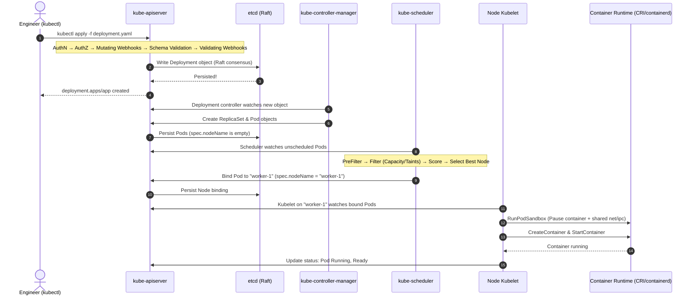

# 5-Minute Refresher: Cluster Architecture & Request Flow

A rapid architectural review of how Kubernetes processes state changes and coordinates distributed components.



---

## The Core Components

| Component | Layer | Stateless? | Key Responsibility |
| :--- | :--- | :--- | :--- |
| **`kube-apiserver`** | Control Plane | **Yes** (Scale horizontally) | Central gateway; authenticates, authorizes, validates, and acts as the sole reader/writer to `etcd`. |
| **`etcd`** | Control Plane | **Stateful** (Strict Raft) | Distributed key-value store holding the single source of truth for the entire cluster. |
| **`kube-controller-manager`** | Control Plane | Active/Standby leader | Runs reconciliation loops (Deployment, ReplicaSet, Node, ServiceAccount, Endpoints). |
| **`kube-scheduler`** | Control Plane | Active/Standby leader | Places unassigned Pods onto suitable worker nodes based on resources, taints, and affinity. |
| **`kubelet`** | Worker Node | Node daemon | Registers node, watches API for assigned pods, commands container runtime via CRI, executes probes. |
| **`kube-proxy`** | Worker Node | DaemonSet / host daemon | Translates Service Virtual IPs into pod routing rules via `nftables` (v1.35+) or `iptables`. |
| **CRI Runtime** | Worker Node | Host daemon (containerd 2.x) | Creates cgroups, namespaces, pulls images, and manages container execution. |

---

## 3 Architectural Rules to Remember

1. **Only the API Server talks to etcd:** No worker node, controller, or scheduler ever talks directly to etcd. If the API server is down, all cluster writes freeze.
2. **Reconciliation is Level-Triggered:** Controllers do not react to events as discrete messages; they continuously reconcile observed state toward desired state. Missing an event does not break the cluster.
3. **Control plane outages do not kill running workloads:** If all control plane nodes crash, running Pods on worker nodes continue serving traffic. Only deployments, auto-scaling, and pod rescheduling are suspended until the control plane recovers.

---

## Rapid Diagnostic Check

Verify control plane and node connectivity:

```bash
# Cluster health endpoints
kubectl get --raw='/readyz?verbose'

# Node status and roles
kubectl get nodes -o wide

# Check core control plane pod events
kubectl get events -n kube-system --sort-by='.metadata.creationTimestamp' | tail -n 20
```

---

## Next Refresher

Proceed to **[[Kubernetes/review/workloads-refresher|Workloads & Pod Lifecycle Refresher]]**.
