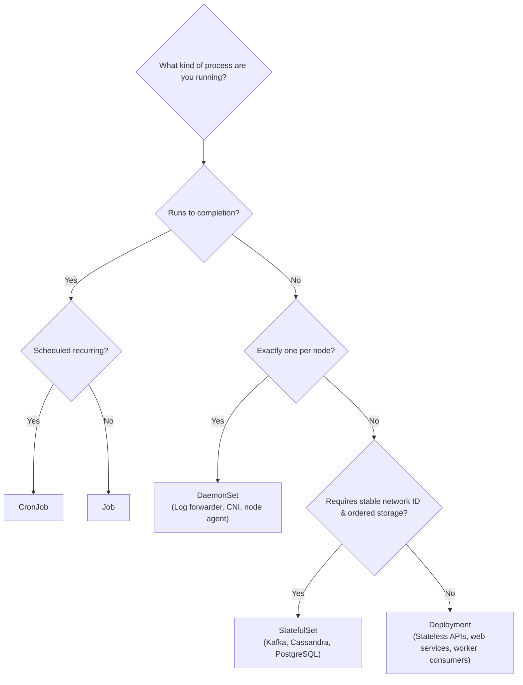
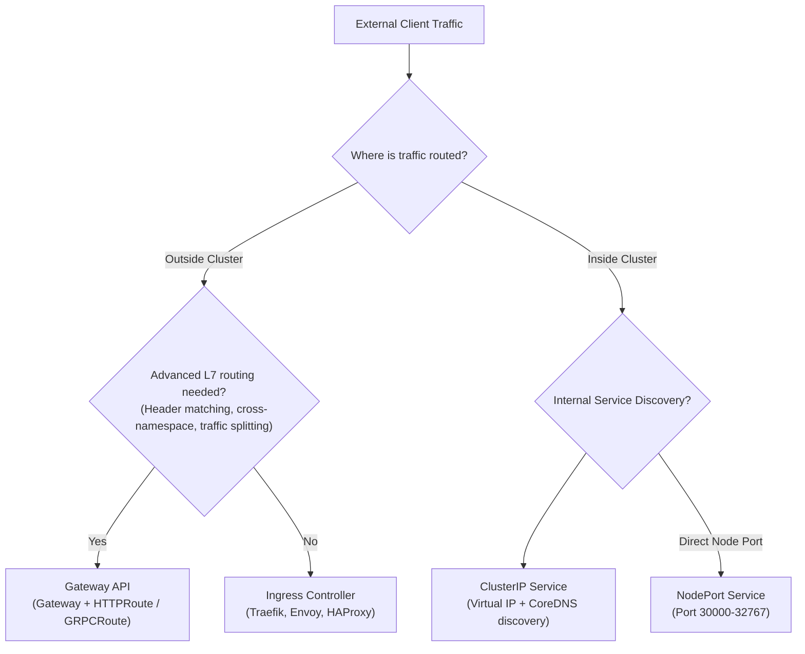

# Kubernetes Master Decision Tables

Architectural decision matrices for selecting the right Kubernetes primitive for your production constraints.

---

## 1. Workload Controller Selection

| Controller | Primary Use Case | State & Identity | Rollout Strategy | When to Choose |
| :--- | :--- | :--- | :--- | :--- |
| **Deployment** | Stateless web APIs, event consumers | Ephemeral pods, random hostnames, dynamic IPs | RollingUpdate (`maxSurge` / `maxUnavailable`), Recreate | Default choice for 90% of business applications. |
| **StatefulSet** | Distributed databases, message queues | Predictable ordinal index (`app-0`), dedicated PVC per replica | RollingUpdate in reverse ordinal order, OnDelete | Clustered databases (Zookeeper, Kafka, MongoDB, Postgres). |
| **DaemonSet** | Node-level infrastructure agents | Exactly 1 Pod per eligible node; ignores node capacity schedulers | RollingUpdate (`maxUnavailable`), OnDelete | Storage daemons, log shippers (Fluent Bit), CNI plugins, monitoring daemons. |
| **Job** | One-off batch execution, DB migrations | Pod runs to completion (`exit 0`), terminates | Parallelism, completions, backoffLimit | Schema migrations, report generation, batch ML inference. |
| **CronJob** | Scheduled recurring jobs | Creates Jobs on a cron schedule (`* * * * *`) | `concurrencyPolicy: Allow \| Forbid \| Replace` | Nightly backups, periodic reconciliation scripts, cleanups. |

---

## 2. Configuration & Secret Management

| Mechanism | Sensitivity | Storage Location | In-Pod Delivery | Update Mechanics | Production Recommendation |
| :--- | :--- | :--- | :--- | :--- | :--- |
| **ConfigMap** | Non-sensitive only | Plaintext in `etcd` | Env vars or volume mount | Volume mounts update via symlink swap; env vars require pod restart | General app settings, JSON/YAML configs. |
| **Kubernetes Secret** | Confidential (tokens, certs) | Base64 encoded in `etcd` (plaintext unless KMS configured) | Env vars or tmpfs volume mount | Volume mounts update automatically; env vars require restart | Acceptable for basic secrets **only** if KMS v2 envelope encryption is enabled. |
| **External Secrets Operator (ESO)** | Highly sensitive (API keys, DB passwords) | External Vault, AWS Secrets Manager, Azure Key Vault | Synchronizes external store into native k8s Secrets | Continuous polling/webhook synchronization | Best practice for enterprise multi-cloud teams with centralized secret stores. |
| **CSI Secret Store Driver** | Extreme sensitivity (Zero footprint) | External Vault / AWS SM | Mounted directly into memory volume; **no native Secret created** | Projected file refreshed at CSI rotation interval | Regulated environments forbidding secrets stored in etcd even in encrypted form. |

---

## 3. Traffic Exposition: Ingress vs Gateway API vs Services

| Mechanism | Layer | Multi-Tenancy | Advanced Routing | Status (2026) | When to Choose |
| :--- | :--- | :--- | :--- | :--- | :--- |
| **ClusterIP** | L4 (TCP/UDP) | Namespace scoped | Round-robin load balancing via EndpointSlices | GA (Core) | Standard intra-cluster communication between internal services. |
| **NodePort** | L4 | Node scoped | Static port range (30000–32767) | GA (Core) | Bare-metal clusters without load balancers; debugging access. |
| **LoadBalancer** | L4 | Cloud provider scoped | Direct cloud load balancer provisioning | GA (Core) | Direct TCP/UDP stream routing into cluster without L7 proxying. |
| **Ingress API** | L7 (HTTP/S) | Single-object (tightly couples host and path routing) | Host/Path routing, basic TLS termination | Stable / Maintenance | Legacy deployments; simple static website hosting. *(Note: `ingress-nginx` retired March 2026)*. |
| **Gateway API** | L7 / L4 | Role-oriented separation: Infra (GatewayClass), Ops (Gateway), Dev (HTTPRoute) | Header matching, traffic splitting/canaries, cross-namespace routing | **GA (Standard Channel)** | **Modern production standard** for all complex ingress, API gateways, and multi-team routing. |

---

## 4. Storage Access Modes & CSI Topology

| Access Mode | CLI Abbr | Description | Supported Backends | Multi-Node Scheduling |
| :--- | :--- | :--- | :--- | :--- |
| **ReadWriteOnce** | `RWO` | Volume mounted as read-write by a **single node**. Multiple pods on that *same* node can mount it. | AWS EBS, GCP PD, Azure Disk, local host path | Pods are bound to the node where the disk was created. |
| **ReadWriteMany** | `RWX` | Volume mounted as read-write by **many nodes simultaneously**. | NFS, AWS EFS, Azure Files, CephFS, GlusterFS | Pods can be scheduled across any nodes in the cluster. |
| **ReadOnlyMany** | `ROX` | Volume mounted as read-only by many nodes simultaneously. | Shared disk snapshots, NFS, object storage gateways | Read-only static assets, reference ML models. |
| **ReadWriteOncePod** | `RWOP` | Volume mounted as read-write by **exactly one single Pod**. | CSI drivers supporting single-pod access | Strict stateful databases that must prevent split-brain write corruption. |

> [!TIP]
> Always pair local-path or cloud block storage StorageClasses with `volumeBindingMode: WaitForFirstConsumer` so the persistent disk is provisioned in the specific Availability Zone where the pod is scheduled.

---

## 5. Autoscaling Selection Matrix

| Autoscaler | Target Metric | Controls | Scale Speed | Caveats & Interplay |
| :--- | :--- | :--- | :--- | :--- |
| **Horizontal Pod Autoscaler (HPA)** | CPU, Memory, Custom metrics | Pod replica count | Minutes (polls every 15s, stabilization window) | Avoid pairing with VPA on CPU/Memory; requires `metrics-server`. |
| **Vertical Pod Autoscaler (VPA)** | Historical CPU/Memory usage | Container resource requests | Minutes/Hours (evicts and restarts pods by default) | In-place vertical scaling (v1.37 GA) reduces restarts; do not pair on same metrics as HPA. |
| **KEDA** | Event-driven queues (Kafka lag, SQS, Redis) | Pod replica count (can scale to 0) | Seconds to minutes | Replaces HPA custom metrics adapters; scales consumers dynamically based on backlog. |
| **Cluster Autoscaler** | Unschedulable `Pending` Pods | Node groups / Auto Scaling Groups | 2–5 minutes (provisions VM instances) | Cloud-specific node groups; slow node scale-up compared to modern provisioners. |
| **Karpenter** | Specific workload resource requests | Direct, heterogeneous EC2/compute node provisioning | 30–60 seconds | Group-less node provisioning; bins pods tightly and optimizes spot/on-demand compute costs. |

---

## 6. Pod Placement & Scheduling Controls

| Control | Constraint Strength | Target Entity | Direction | Primary Use Case |
| :--- | :--- | :--- | :--- | :--- |
| **`nodeSelector`** | Hard filter | Node labels | Attracts | Simple placement: `disktype: ssd`, `gpu: "true"`. |
| **`nodeAffinity`** | Hard (`required`) or Soft (`preferred`) | Node labels | Attracts | Multi-zone placement, architecture preferences (`arm64` vs `amd64`). |
| **`podAntiAffinity`** | Hard (`required`) or Soft (`preferred`) | Other Pod labels | Repels | High availability: keep replicas of the same service on separate nodes/zones. |
| **`topologySpreadConstraints`** | Hard (`DoNotSchedule`) or Soft (`ScheduleAnyway`) | Topology domain (zone, rack, host) | Balances | Distributes pods evenly across failure domains (`maxSkew: 1`). |
| **`taints` & `tolerations`** | Hard (`NoSchedule`), Soft (`PreferNoSchedule`), Evict (`NoExecute`) | Node condition | Repels by default | Dedicated GPU nodes, master node protection, node draining. |

---

## 7. Cluster Governance & Policy Engines

| Engine / Mechanism | Language | Evaluation Phase | Mutation Support | Best Used For |
| :--- | :--- | :--- | :--- | :--- |
| **RBAC** | Native API YAML | Authorization (Pre-admission) | No | Controlling who can call which API verbs on which resources. |
| **Pod Security Standards (PSS)** | Built-in namespace labels | Admission (Validation) | No | Enforcing baseline/restricted container hardening without installing third-party controllers. |
| **ValidatingAdmissionPolicy (VAP)** | Common Expression Language (CEL) | Admission (Validation) | No | **In-tree, high-performance** validation rules evaluated directly in `kube-apiserver` without webhook latency. |
| **Kyverno** | Native Kubernetes YAML | Admission (Validation, Mutation, Generation) | **Yes** | Comprehensive policy management: auto-injecting labels, mutating configs, verifying Cosign image signatures. |
| **OPA / Gatekeeper** | Rego | Admission (Validation, Audit) | Limited | Enterprise multi-system governance spanning Kubernetes, CI/CD, and Terraform. |
| **NetworkPolicy** | Native API YAML | Data Plane (CNI) | No | Isolating pod-to-pod network traffic; enforcing microsegmentation. |

---

## Next Steps

- Review the rapid five-minute syntheses: **[[Kubernetes/review/architecture-refresher|Architecture Refresher]]** and **[[Kubernetes/review/workloads-refresher|Workloads Refresher]]**.
- Test your triage reflexes across production failure scenarios in **[[Kubernetes/review/scenarios|Scenario-Based Incident Reviews]]**.
