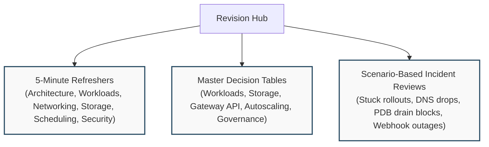

# Kubernetes Revision System & Experienced Reader Hub

Designed for senior platform engineers, architects, and candidates preparing for interviews or certification renewals. If you already understand the fundamentals and need rapid architectural synthesis, decision frameworks, or incident review scenarios, this hub provides zero-fluff reference material.

---

## 1. Five-Minute Topic Refreshers

Compact, single-page architectural syntheses with diagrams, core rules, and common failure modes:

| Refresher | Core Focus | Key Diagram / Mechanism |
| :--- | :--- | :--- |
| [[Kubernetes/review/architecture-refresher\|Architecture Refresher]] | Control plane, nodes, and request flow | `kubectl apply` → etcd → controller → scheduler → kubelet |
| [[Kubernetes/review/workloads-refresher\|Workloads Refresher]] | Controller hierarchy & Pod lifecycle | Dual-ReplicaSet handoff & graceful termination timeline |
| [[Kubernetes/review/networking-refresher\|Networking Refresher]] | Service VIPs, EndpointSlices & Gateway API | Packet path from client to pod socket via nftables |
| [[Kubernetes/review/storage-refresher\|Storage Refresher]] | PV, PVC, StorageClass & CSI lifecycle | Provisioning vs VolumeAttachment vs node mount |
| [[Kubernetes/review/scheduling-scaling-refresher\|Scheduling & Scaling Refresher]] | Filtering, scoring, QoS & autoscaling | Kube-scheduler pipeline & HPA metrics resolution |
| [[Kubernetes/review/security-refresher\|Security Refresher]] | AuthN/Z, PSS, admission & NetworkPolicy | Progressive 5-ring defense-in-depth model |

---

## 2. Master Decision Tables

Direct architectural comparison matrices to choose the right Kubernetes primitive for your production constraints:

- **[[Kubernetes/review/decision-tables|Master Decision Tables]]**:
  1. **Workloads:** Deployment vs StatefulSet vs DaemonSet vs Job vs CronJob
  2. **Config & Credentials:** ConfigMap vs Secret vs External Secrets Operator (ESO) vs HashiCorp Vault
  3. **Traffic Exposition:** ClusterIP vs NodePort vs LoadBalancer vs Ingress vs Gateway API
  4. **Storage Access Modes:** ReadWriteOnce (RWO) vs ReadWriteMany (RWX) vs ReadWriteOncePod (RWOP)
  5. **Autoscaling Family:** HPA vs VPA vs KEDA vs Cluster Autoscaler vs Karpenter
  6. **Pod Placement Controls:** NodeSelector vs NodeAffinity vs PodAntiAffinity vs TopologySpreadConstraints vs Taints/Tolerations
  7. **Cluster Governance:** RBAC vs Pod Security Standards (PSS) vs ValidatingAdmissionPolicy (CEL) vs Kyverno
  8. **Application Packaging:** Raw YAML vs Kustomize vs Helm vs GitOps (Argo CD / Flux)

---

## 3. Scenario-Based Incident Reviews

Realistic, multi-layered production incident post-mortems with diagnostic commands and root-cause analysis:

- **[[Kubernetes/review/scenarios|Scenario-Based Incident Reviews]]**:
  - **Scenario 1:** A Deployment has desired replicas but zero available Pods.
  - **Scenario 2:** A Service resolves in DNS but TCP connections time out.
  - **Scenario 3:** HPA requests 10 replicas, but new Pods stay stuck in `Pending`.
  - **Scenario 4:** `kubectl drain` on a worker node hangs indefinitely.
  - **Scenario 5:** A StatefulSet Pod cannot reschedule due to volume attachment conflicts.
  - **Scenario 6:** A validating admission webhook outage blocks all cluster deployments.
  - **Scenario 7:** Workload communicates with unauthorized cloud metadata endpoints (SSRF risk).

---

## Quick Navigation

- Return to the comprehensive beginner curriculum: **[[Kubernetes/concepts/00-hub|Curriculum Hub]]**
- Jump to symptom-specific debugging: **[[Kubernetes/troubleshooting|Troubleshooting Index]]**
- Test your skills in the multi-node lab environment: **[[Kubernetes/labs/index|Kubernetes Hands-On Labs]]**
