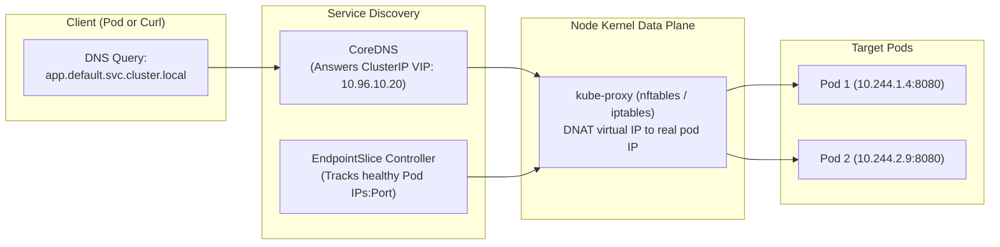
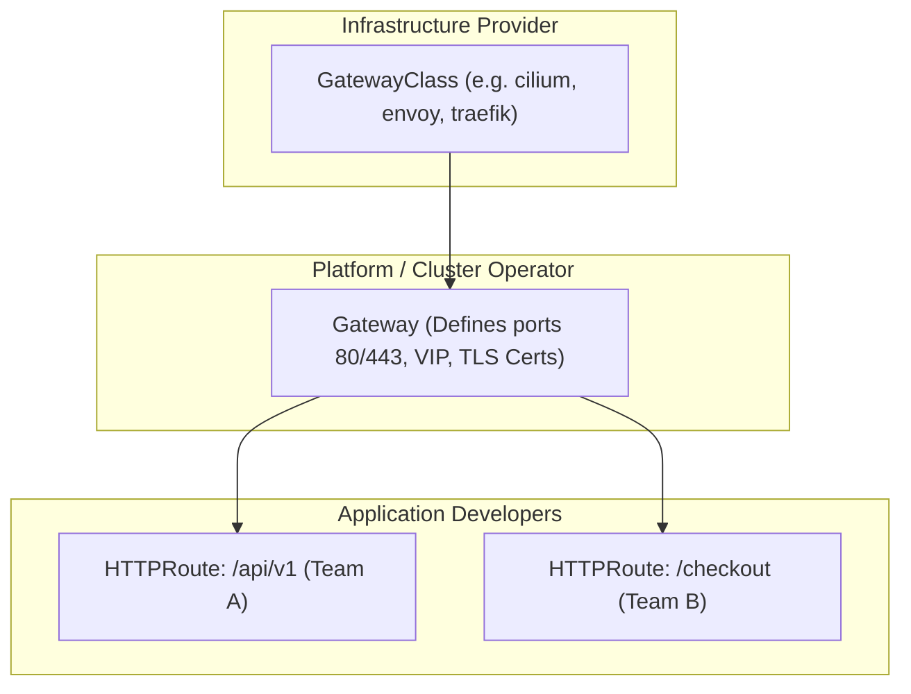

# 5-Minute Refresher: Networking, Services & Gateway API

A rapid architectural review of how Kubernetes routes network traffic between pods, through services, and from external ingress.



---

## 4 Fundamental Networking Concepts

1. **Every Pod has a real, routable IP:** Pods communicate with all other pods across nodes without NAT (handled by the CNI plugin).
2. **Services are Virtual IPs (VIPs):** A `ClusterIP` does not belong to any network interface. It is an abstract IP managed by kernel packet rewrite rules (`nftables` or `iptables`) installed by `kube-proxy`.
3. **EndpointSlices track backends:** Modern Kubernetes replaces monolithic `Endpoints` objects with scalable `EndpointSlice` resources (up to 100 endpoints per slice).
4. **CoreDNS handles name resolution:** Services resolve to:
   ```
   <service-name>.<namespace>.svc.cluster.local
   ```

---

## Gateway API vs Ingress

In modern Kubernetes (**v1.35 – v1.37**), the community has transitioned from the legacy single-object `Ingress` specification to **Gateway API**:



### Why Gateway API Won:
- **Role-oriented separation:** Platform admins manage infrastructure (`Gateway`), while product teams manage routing rules (`HTTPRoute`) independently.
- **Cross-namespace routing:** Routes in `namespace-a` can attach to a shared corporate `Gateway` in `infrastructure-gateway`.
- **Built-in traffic splitting:** Native canary weights without vendor-specific annotations:
  ```yaml
  backendRefs:
    - name: app-v1
      port: 8080
      weight: 90
    - name: app-v2
      port: 8080
      weight: 10
  ```

---

## Diagnostic Commands

```bash
# Check service endpoints
kubectl get endpointslices -l kubernetes.io/service-name=<svc-name>

# Inspect service selector
kubectl describe svc <svc-name> | grep -E "Selector:|Endpoints:"

# Test DNS from an ephemeral client
kubectl run curl-test --image=curlimages/curl:8.10.1 --rm -it --restart=Never -- nslookup <svc-name>
```

---

## Next Refresher

Proceed to **[[Kubernetes/review/storage-refresher|Storage, PVCs & CSI Refresher]]**.
