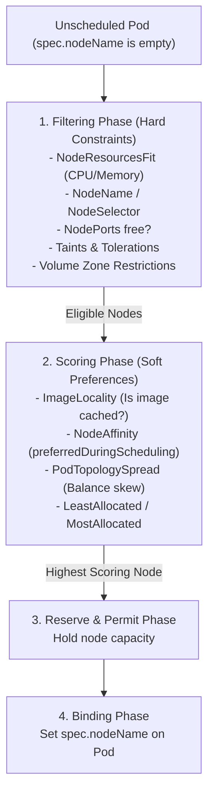
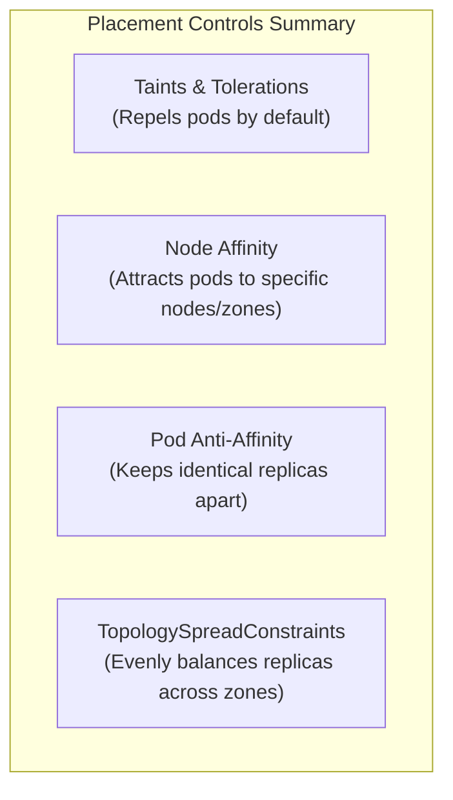
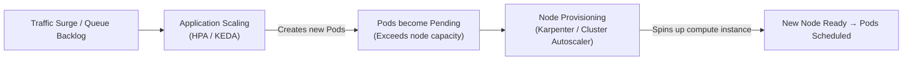

# 5-Minute Refresher: Scheduling, QoS & Scaling

A rapid architectural review of how Kubernetes places, protects, and scales compute workloads.



---

## Quality of Service (QoS) & Node Eviction

Under node memory pressure, the Linux kernel OOM killer terminates processes based on their `oom_score_adj`:

| QoS Class | Resource Criteria | OOM Priority | Production Role |
| :--- | :--- | :--- | :--- |
| **`Guaranteed`** | `requests == limits` for both CPU and Memory across all containers | **Last to be killed** (`oom_score_adj: -997`) | Critical databases, core APIs, stateful services. |
| **`Burstable`** | `requests < limits` or only requests specified | **Killed if exceeding requests** | Standard business workloads, background workers. |
| **`BestEffort`** | Zero requests or limits defined | **First to be killed** (`oom_score_adj: 1000`) | Development test pods, throwaway batch tasks. |

---

## High-Availability Placement Controls



### Golden Rule for Availability:
Always define `topologySpreadConstraints` on production Deployments:

```yaml
topologySpreadConstraints:
  - maxSkew: 1
    topologyKey: topology.kubernetes.io/zone
    whenUnsatisfiable: DoNotSchedule
    labelSelector:
      matchLabels:
        app: my-service
```

---

## Autoscaling Hierarchy



1. **HPA:** Scales pod replicas based on CPU, memory, or custom Prometheus metrics via `metrics.k8s.io`.
2. **KEDA:** Event-driven scaler that scales pods based on external triggers (Kafka consumer lag, SQS depth, RabbitMQ queues), including scale-to-zero.
3. **Karpenter:** Fast, group-less node provisioner that directly launches right-sized cloud VMs within ~45 seconds when unscheduled pods appear.

---

## Safe Maintenance: PodDisruptionBudgets (PDB)

A **PodDisruptionBudget (PDB)** limits the number of pods of a replicated application that can be down simultaneously from voluntary disruptions (e.g. `kubectl drain` during node upgrades):

```yaml
apiVersion: policy/v1
kind: PodDisruptionBudget
metadata:
  name: api-pdb
spec:
  minAvailable: 1
  selector:
    matchLabels:
      app: my-service
```

If a node drain violates the PDB, `kubectl drain` blocks until replacement pods on other nodes become `Ready`.

---

## Diagnostic Commands

```bash
# Check unscheduled pod events
kubectl describe pod <pod-name> | grep -A 8 "Events:"

# Check node allocatable capacity
kubectl get nodes -o custom-columns=NAME:.metadata.name,CPU:.status.allocatable.cpu,MEM:.status.allocatable.memory

# Check HPA targets and current utilization
kubectl get hpa

# Check PDB disruption status
kubectl get pdb
```

---

## Next Refresher

Proceed to **[[Kubernetes/review/security-refresher|Security, RBAC & Hardening Refresher]]**.
