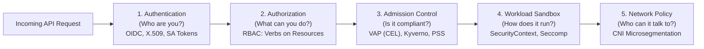

# 5-Minute Refresher: Security, RBAC & Hardening

A rapid architectural review of identity verification, permissions, admission control, container sandboxing, and network isolation.



---

## 1. RBAC (Role-Based Access Control)

Kubernetes evaluates RBAC at the API request level using three components:

```
[Subject: User / Group / ServiceAccount]
         │
         ▼ bound via RoleBinding / ClusterRoleBinding
[Role / ClusterRole: Verbs (get, list, watch, create, delete) on Resources (pods, services, secrets)]
```

### Golden Rules:
- **Never use wildcard verbs (`*`) in production:** Grant only the exact verbs needed.
- **Never grant `escalate` or `bind` to untrusted identities:** An attacker can use `bind` to grant themselves `cluster-admin`.
- **Disable automatic token mounts:** Set `automountServiceAccountToken: false` on ServiceAccounts unless the workload actively communicates with the Kubernetes API.

---

## 2. Pod Security Standards (PSS) & SecurityContext

Kubernetes provides built-in admission standards via namespace labels:

| Profile | Target Environment | Key Restrictions |
| :--- | :--- | :--- |
| **`privileged`** | Infrastructure / CNI | No restrictions; allows full host root and capabilities. |
| **`baseline`** | Standard apps | Prevents host namespaces, host ports, and privileged execution. |
| **`restricted`** | **Production Baseline** | Enforces non-root (`runAsNonRoot: true`), read-only root filesystem, drops `ALL` Linux capabilities, enforces `RuntimeDefault` seccomp. |

### The Production `securityContext` Baseline:
```yaml
securityContext:
  runAsNonRoot: true
  runAsUser: 10001
  runAsGroup: 10001
  allowPrivilegeEscalation: false
  readOnlyRootFilesystem: true
  capabilities:
    drop:
      - ALL
  seccompProfile:
    type: RuntimeDefault
```

---

## 3. Network Isolation (NetworkPolicy)

By default, Kubernetes networking is completely open: **every Pod can reach every other Pod and external IP**.

### Production Microsegmentation:
Always enforce a **Default Deny** policy on every application namespace:

```yaml
apiVersion: networking.k8s.io/v1
kind: NetworkPolicy
metadata:
  name: default-deny-all
  namespace: production
spec:
  podSelector: {}
  policyTypes:
    - Ingress
    - Egress
```

Then explicitly whitelist:
1. **Ingress:** Allow inbound traffic on application ports from designated gateway/caller pods.
2. **Egress:** Allow UDP/TCP port 53 to CoreDNS in `kube-system`, and specific database/API destination CIDRs.

---

## 4. Encryption at Rest (KMS v2)

Kubernetes Secrets are merely base64-encoded strings by default—**not encrypted**. In production clusters, configure KMS v2 envelope encryption in `kube-apiserver`:
- Data Encryption Keys (DEKs) encrypt Secrets locally.
- A remote Key Management Service (AWS KMS, GCP KMS, Vault) encrypts DEKs using a Key Encryption Key (KEK).
- Unencrypted secrets never touch etcd disk storage.

---

## Diagnostic Commands

```bash
# Test API permissions as a specific user or ServiceAccount
kubectl auth can-i create deployments --namespace default
kubectl auth can-i list secrets --as=system:serviceaccount:default:my-app

# Check namespace Pod Security enforcement
kubectl get ns -L pod-security.kubernetes.io/enforce

# Check active NetworkPolicies
kubectl get networkpolicies -A
```

---

## Next Steps

Review real-world incident walkthroughs in **[[Kubernetes/review/scenarios|Scenario-Based Incident Reviews]]**.
