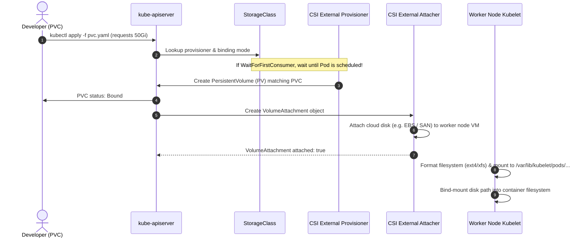

# 5-Minute Refresher: Storage, PVCs & CSI Architecture

A rapid architectural review of persistent volume provisioning, CSI attachment, and storage lifecycle management.



---

## 4 Core Storage Rules

1. **PVC is a Claim, PV is the Disk:** A `PersistentVolumeClaim` is a user request for storage capacity. A `PersistentVolume` is the actual cluster disk resource provisioned to satisfy that claim.
2. **StorageClasses Drive Dynamic Provisioning:** Manual PV creation is an operational anti-pattern. Workloads reference a `StorageClass`, and CSI controllers automatically provision the underlying block or file storage on demand.
3. **Always use `WaitForFirstConsumer` for Block Storage:** Setting `volumeBindingMode: WaitForFirstConsumer` prevents scheduling deadlocks by ensuring the cloud disk is created in the exact Availability Zone where the pod's worker node resides.
4. **`Recycle` is deprecated:** Only two modern reclaim policies exist:
   - **`Delete`:** Deleting the PVC automatically destroys the underlying cloud storage volume.
   - **`Retain`:** Deleting the PVC preserves the PV and storage volume for manual data recovery.

---

## Storage Access Modes Summary

| Mode | Short | Node Scope | Backend Types | Typical Workload |
| :--- | :--- | :--- | :--- | :--- |
| **ReadWriteOnce** | `RWO` | Single node | Block storage (EBS, PD, Azure Disk, local path) | Databases (Postgres, MySQL, MongoDB) |
| **ReadWriteMany** | `RWX` | Many nodes | File storage (NFS, EFS, Azure Files, CephFS) | Content management (WordPress), shared ML data |
| **ReadOnlyMany** | `ROX` | Many nodes | Read-only snapshots, NFS | Static assets, reference datasets |
| **ReadWriteOncePod** | `RWOP` | Single Pod | Specific CSI block drivers | Strict stateful databases preventing split-brain |

---

## Diagnostic Commands

```bash
# Check claim and volume binding
kubectl get pvc,pv

# Check cloud disk node attachment state
kubectl get volumeattachments

# Inspect storage controller events for pending claims
kubectl describe pvc <pvc-name> | grep -A 8 "Events:"
```

---

## Next Refresher

Proceed to **[[Kubernetes/review/scheduling-scaling-refresher|Scheduling, QoS & Scaling Refresher]]**.
