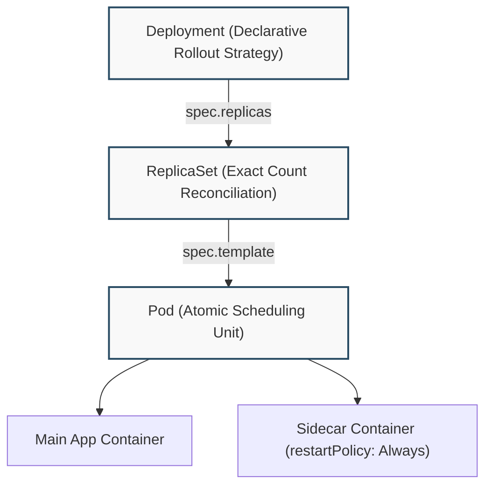
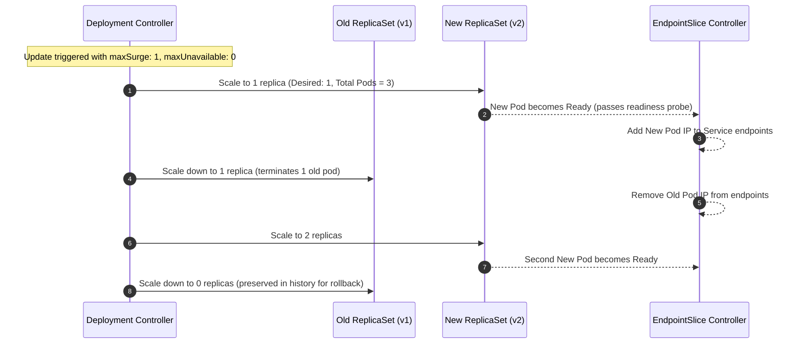

# 5-Minute Refresher: Workloads & Pod Lifecycle

A rapid architectural review of workload ownership, rolling updates, and the graceful termination lifecycle.



---

## The RollingUpdate Handoff

When a Deployment is patched with a new container image or environment variable, the controller orchestrates a seamless handoff between two ReplicaSets:



---

## Graceful Termination & Zero-Downtime Rule

When a Pod is terminated, Kubernetes executes two independent operations **in parallel**:

```
Timeline:
T0: Pod marked Terminating in apiserver
    ├── Thread A: EndpointSlice controller removes Pod IP from Service routing (takes 1–5s to propagate)
    └── Thread B: Kubelet executes preStop hook → sends SIGTERM → waits terminationGracePeriodSeconds → sends SIGKILL
```

> [!IMPORTANT]
> If your application does not have a `preStop` hook with a brief delay (e.g. `sleep 5`), the application process might exit immediately upon receiving `SIGTERM` before kube-proxy and ingress proxies have completed updating their routing tables. This causes client requests to be sent to a dead socket, resulting in `502 Bad Gateway` drops.

### Recommended `preStop` Configuration:
```yaml
lifecycle:
  preStop:
    exec:
      command: ["/bin/sh", "-c", "sleep 10 && app -s quit"]
```

---

## Modern Workload Features (v1.37 Baseline)

1. **Native Sidecars (GA in v1.29+):** Define long-running auxiliary sidecars inside `spec.initContainers` with `restartPolicy: Always`. They start before the main container and remain running until all other containers terminate.
2. **In-Place Pod Resize (GA in v1.37):** Change container CPU and memory requests/limits in-place without triggering pod recreation or disruption.

---

## Diagnostic Commands

```bash
# Rollout status and revision history
kubectl rollout status deployment/<name>
kubectl rollout history deployment/<name>

# Instant rollback to previous version
kubectl rollout undo deployment/<name>

# Check granular pod readiness conditions
kubectl get pod <pod-name> -o jsonpath='{range .status.conditions[*]}{.type}{"="}{.status}{"\n"}{end}'
```

---

## Next Refresher

Proceed to **[[Kubernetes/review/networking-refresher|Networking, Services & Gateway API Refresher]]**.
