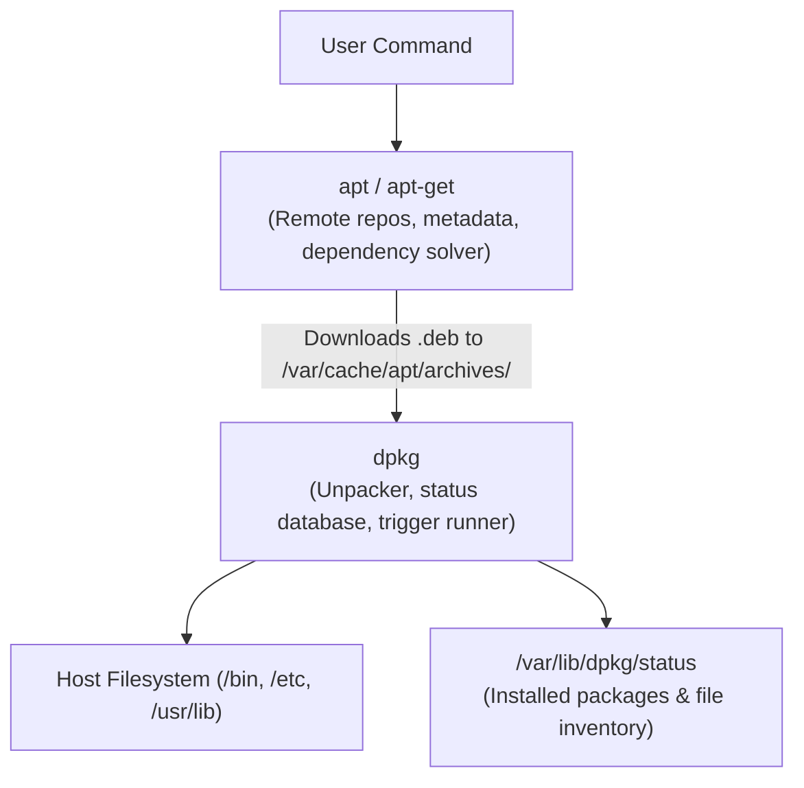

# dpkg Low-Level Package Manager 📦

`dpkg` (Debian Package) is the low-level tool behind `apt` on Debian, Ubuntu, and derivative Linux distributions. While `apt` handles remote repository downloads and dependency resolution, `dpkg` directly unpacks, inspects, installs, and audits local `.deb` files.

---

## 1. dpkg vs APT Architecture



---

## 2. Essential dpkg Operations

### 1. Installing & Removing Local `.deb` Archives

```bash
# Install a local deb package
sudo dpkg -i package.deb

# If dependencies are missing after dpkg -i:
sudo apt-get install -f -y   # Fix broken dependencies automatically

# Remove package (keeps configuration files)
sudo dpkg -r package-name

# Purge package (deletes configuration files in /etc)
sudo dpkg -P package-name
```

### 2. Inspecting & Auditing Packages

```bash
# List all installed packages and their status
dpkg -l

# Search installed packages
dpkg -l "*nginx*"

# View files installed by a package
dpkg -L nginx

# Find which package owns a specific file on disk
dpkg -S /etc/nginx/nginx.conf

# Inspect contents of an uninstalled .deb archive
dpkg -c package.deb

# Extract package metadata and control files without installing
dpkg -I package.deb
```

---

## 3. Package Reconfiguration & Triggers

Debian packages use `debconf` scripts for interactive or pre-seeded post-install configuration:

```bash
# Reconfigure installed package settings (e.g. timezone, locales)
sudo dpkg-reconfigure tzdata
sudo dpkg-reconfigure locales

# Configure all unpacked but unconfigured packages
sudo dpkg --configure -a
```

---

## 4. Recovering from Corrupted Package State

If an installation was killed mid-execution:

```bash
# 1. Clear locks if no process is running
sudo rm /var/lib/dpkg/lock-frontend
sudo rm /var/lib/dpkg/lock

# 2. Resume uncompleted configuration scripts
sudo dpkg --configure -a

# 3. Clean and reinstall broken packages via apt
sudo apt-get clean
sudo apt-get update --fix-missing
sudo apt-get install -f
```

---

## Related Notes in Wiki

- [[Linux/packaging/apt|APT Package Tool]]
- [[Linux/packaging/package-repos|Linux Package Repositories]]
- [[Linux/packaging/yum-dnf|YUM and DNF (RPM counterpart)]]
