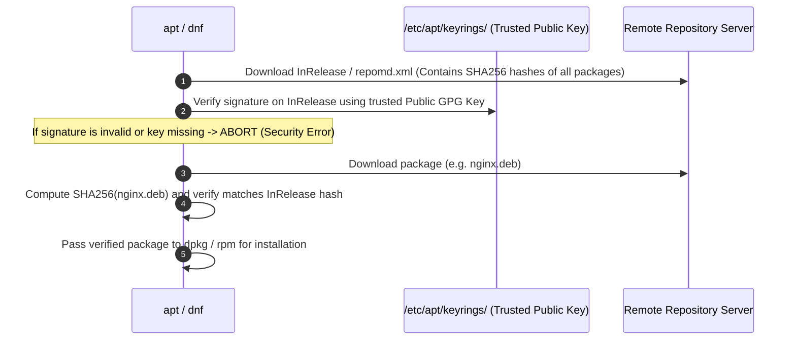

# Linux Package Repositories & Keyrings 🌐

Package repositories are cryptographically verified HTTP/HTTPS file servers delivering compiled software packages, dependency metadata, and integrity checksums to Linux systems.

---

## 1. Cryptographic Trust Model (GPG Signatures)

Modern distributions require every repository metadata file (`InRelease` / `repomd.xml`) to be cryptographically signed by the repository maintainer's private GPG key:



---

## 2. Modern Debian/Ubuntu Repositories (deb822 Format)

Legacy `apt-key add` has been deprecated since Ubuntu 22.04 / Debian 11 due to security risks (it allowed keys to sign _any_ package). Modern distributions use **deb822 format** (`/etc/apt/sources.list.d/*.sources`) with isolated keyrings in `/etc/apt/keyrings/`:

```ini
# /etc/apt/sources.list.d/docker.sources
Types: deb
URIs: https://download.docker.com/linux/ubuntu
Suites: noble
Components: stable
Architectures: amd64 arm64
Signed-By: /etc/apt/keyrings/docker.gpg
```

### Adding a Secure Third-Party Repository

```bash
# 1. Download and de-armor GPG key into dedicated directory
sudo install -m 0755 -d /etc/apt/keyrings
curl -fsSL https://download.docker.com/linux/ubuntu/gpg | sudo gpg --dearmor -o /etc/apt/keyrings/docker.gpg
sudo chmod a+r /etc/apt/keyrings/docker.gpg

# 2. Add deb822 source entry
cat <<EOF | sudo tee /etc/apt/sources.list.d/docker.sources
Types: deb
URIs: https://download.docker.com/linux/ubuntu
Suites: $(lsb_release -cs)
Components: stable
Signed-By: /etc/apt/keyrings/docker.gpg
EOF

# 3. Update and install
sudo apt-get update
sudo apt-get install -y docker-ce
```

---

## 3. RPM-Based Repositories (DNF / YUM)

RPM repositories store repository configuration in `/etc/yum.repos.d/*.repo`:

```ini
[hashicorp]
name=Hashicorp Stable - $basearch
baseurl=https://rpm.releases.hashicorp.com/RHEL/$releasever/$basearch/stable
enabled=1
gpgcheck=1
gpgkey=https://rpm.releases.hashicorp.com/gpg
```

- `gpgcheck=1`: Verifies the package signature against the imported key.
- `repo_gpgcheck=1`: Verifies the metadata signature itself.

---

## 4. Community Repositories: PPA, COPR & AUR

- **Ubuntu PPA (Personal Package Archive):** Launchpad-hosted community repositories added via `add-apt-repository ppa:owner/name`.
- **Fedora COPR (Cool Other Package Repo):** Community build system for Fedora/RHEL added via `dnf copr enable owner/project`.
- **Arch AUR (Arch User Repository):** Community build scripts (`PKGBUILD`) compiled locally using `makepkg` or AUR helpers (`yay`, `paru`).

---

## Related Notes in Wiki

- [[Linux/packaging/apt|APT Package Tool]]
- [[Linux/packaging/dpkg|dpkg Low-Level Tool]]
- [[Linux/packaging/yum-dnf|YUM and DNF (RHEL/Fedora)]]
- [[Linux/security/README|Linux Security Hardening]]
