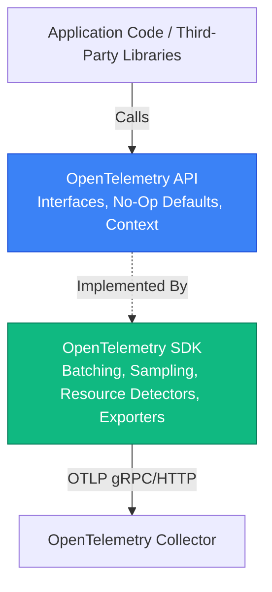

# OpenTelemetry SDK & Language Architecture

A core architectural principle of OpenTelemetry is the strict separation between the **API** and the **SDK**.



---

## 1. The API vs SDK Split

- **The API (Dependency for Libraries):** Contains only interfaces and no-op implementations. Library authors (like HTTP framework or database driver maintainers) depend **only** on the OpenTelemetry API. If an application does not initialize an SDK, calls to the API are cost-free no-ops.
- **The SDK (Dependency for Applications):** Contains the actual operational implementation: memory buffering, span batching, head/tail sampling, resource attribution, and network exporters. Only the top-level application binary imports and configures the SDK.

---

## 2. Auto-Instrumentation vs Manual Instrumentation

| Mechanism                     | How It Works                              | Languages Supported   | Pros & Cons                                                |
| :---------------------------- | :---------------------------------------- | :-------------------- | :--------------------------------------------------------- |
| **Bytecode / Agent**          | Instruments class loading at runtime      | Java, .NET            | Zero code changes; slight startup overhead                 |
| **Monkey Patching**           | Wraps library imports dynamically         | Python, Node.js       | Fast setup; may conflict with custom monkey patches        |
| **eBPF Auto-Instrumentation** | Kernel probes capture network/syscalls    | Go, C++, Rust, Kernel | 100% non-invasive; limited L7 application-specific context |
| **Manual Instrumentation**    | Explicit calls in code (`tracer.Start()`) | All languages         | Full control, domain context; requires code changes        |

---

## 3. Production SDK Initialization Pattern (Go)

```go
package main

import (
	"context"
	"time"

	"go.opentelemetry.io/otel"
	"go.opentelemetry.io/otel/exporters/otlp/otlptrace/otlptracegrpc"
	"go.opentelemetry.io/otel/sdk/resource"
	sdktrace "go.opentelemetry.io/otel/sdk/trace"
	semconv "go.opentelemetry.io/otel/semconv/v1.24.0"
)

func initTracer(ctx context.Context) (*sdktrace.TracerProvider, error) {
	exporter, err := otlptracegrpc.New(ctx,
		otlptracegrpc.WithInsecure(),
		otlptracegrpc.WithEndpoint("otel-collector:4317"),
	)
	if err != nil {
		return nil, err
	}

	res, err := resource.New(ctx,
		resource.WithAttributes(
			semconv.ServiceNameKey.String("order-service"),
			semconv.DeploymentEnvironmentKey.String("production"),
		),
		resource.WithHost(),
		resource.WithProcess(),
	)
	if err != nil {
		return nil, err
	}

	tp := sdktrace.NewTracerProvider(
		sdktrace.WithBatcher(exporter, sdktrace.WithBatchTimeout(5*time.Second)),
		sdktrace.WithResource(res),
		sdktrace.WithSampler(sdktrace.ParentBased(sdktrace.TraceIDRatioBased(0.1))), // 10% sampling
	)

	otel.SetTracerProvider(tp)
	return tp, nil
}
```
