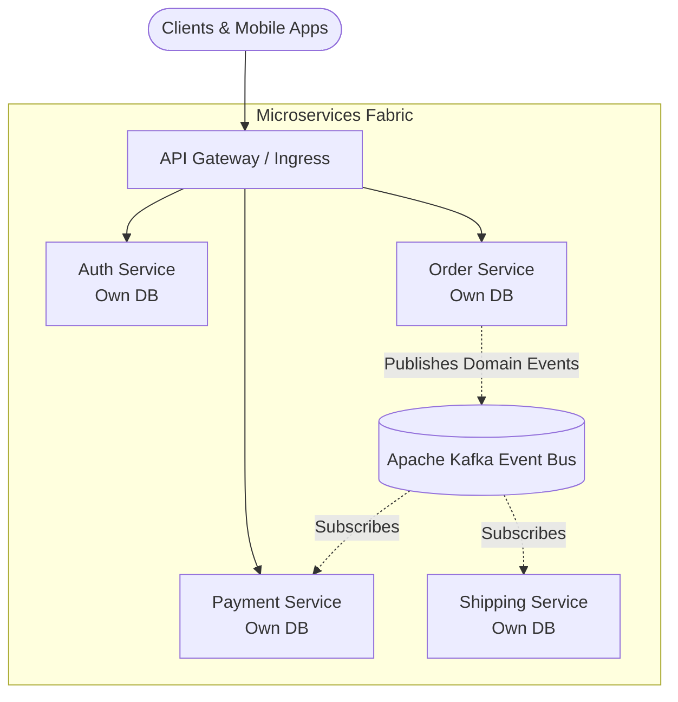

# Microservices Architecture Patterns & Migration Strategies

A **Microservices Architecture** structures an application as a collection of small, autonomous, loosely coupled services modeled around business domains. Each microservice is independently deployable, maintains its own data persistence layer, and communicates via lightweight network protocols (HTTP/REST, gRPC, or message brokers).

---

## 1. Monolith vs Microservices: The Distributed Systems Tax

Adopting microservices solves organizational scaling (enabling 50 autonomous squads to deploy independently), but introduces the **Distributed Systems Tax**:

| Dimension                | Monolithic Architecture                      | Microservices Architecture                           |
| :----------------------- | :------------------------------------------- | :--------------------------------------------------- |
| **Deployability**        | All-or-nothing release                       | **Independent per-service deployments**              |
| **Data Consistency**     | ACID transactions across tables              | **Eventual consistency / Sagas**                     |
| **Network Failure**      | In-memory function call (0ms, 100% reliable) | Network round-trip (packet loss, timeouts, latency)  |
| **Debugging / Tracing**  | Single stack trace                           | Distributed tracing required (OpenTelemetry)         |
| **Operational Overhead** | Low (Single deployment target)               | High (Kubernetes, service meshes, service discovery) |

---

## 2. Decomposition Patterns (Domain-Driven Design)

1. **Decompose by Business Capability:** Align services to business functions (e.g. Order Management, Inventory, Invoicing).
2. **Decompose by Bounded Context (DDD):** Identify distinct domain models. For example, a `Customer` means something completely different to the Marketing squad than to the Billing squad. Instead of a single god-class `Customer` table, create two distinct bounded contexts with their own schemas.

---

## 3. Distributed Data & Transaction Management

In microservices, the golden rule is: **One Database per Microservice**. Never share a database between microservices.

### 1. The Saga Pattern (Distributed Transactions)

When a business operation spans multiple services (e.g. Create Order -> Authorize Payment -> Reserve Inventory):

- **Choreography:** Services publish events to a message broker; downstream services listen and react autonomously.
- **Orchestration:** A central coordinator service explicitly commands each participant. If a step fails, the orchestrator invokes **Compensating Transactions** (e.g. `refundPayment()`).

### 2. The Transactional Outbox Pattern

Avoids dual-write inconsistencies between updating the database and publishing to Kafka:

- Write the business entity AND an event record into an `outbox` database table within a **single local ACID transaction**.
- A CDC process (Debezium) or poller reads the outbox table and streams events to Kafka with guaranteed at-least-once delivery.

---

## 4. Migration Patterns

- [[Architecture/solution-architecture-concepts/migration-patterns/strangler-fig|The Strangler Fig Pattern]]: Incrementally route specific API paths away from the legacy monolith to new microservices until the monolith disappears.
- [[Architecture/solution-architecture-concepts/migration-patterns/expand-contract|Expand and Contract]]: Safely evolve shared schemas and API contracts without downtime.
