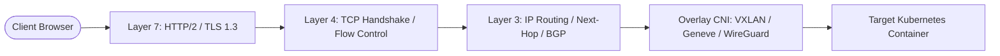

# Cloud-Native Networking Architecture Guide

Understanding how packets traverse physical cables, operating system kernels, virtual network interfaces, overlay networks, and reverse proxies is the most fundamental diagnostic skill in cloud-native infrastructure engineering.

---

## 1. Core Curriculum & Modules

### Foundations & Protocols

- [[Architecture/solution-architecture-concepts/networking/osi-model|OSI 7-Layer Model]]: Protocol Data Units (PDUs), packet encapsulation, and layer-by-layer troubleshooting.
- [[Architecture/solution-architecture-concepts/networking/tcpip|TCP/IP Architecture]]: 3-way handshake, 4-way close, `TIME_WAIT` vs `CLOSE_WAIT`, sliding window flow control, and BBR vs CUBIC congestion algorithms.
- [[Architecture/solution-architecture-concepts/networking/routing|IP Routing & BGP]]: Longest Prefix Match (LPM), routing tables, OSPF link-state vs BGP path-vector, and ECMP hash polarization.

### Real-Time & Streaming Protocols

- [[Architecture/solution-architecture-concepts/protocols/webrtc|WebRTC Architecture]]: Peer-to-peer audio/video streaming, SDP signaling, and NAT traversal via STUN/TURN.
- [[Architecture/solution-architecture-concepts/protocols/server-sent-events|Server-Sent Events (SSE)]]: Lightweight HTTP streaming for LLM token-by-token generation.

### Cloud & Kubernetes Networking

- [[AWS/networking/README|AWS VPC Networking]]: Subnets, Route Tables, Internet Gateways, NAT Gateways, Transit Gateway, and PrivateLink.
- [[Kubernetes/concepts/L04-services-networking/00-README|Kubernetes Networking]]: Pod-to-Pod communication, ClusterIP/NodePort Services, CNI plugins (Cilium, Calico), and Ingress controllers.
