# Observability Architecture & Implementation Guide

**Observability** is a measure of how well internal states of a system can be inferred solely from knowledge of its external outputs (metrics, logs, traces, and profiles). In complex distributed microservices, observability allows engineers to ask novel, open-ended questions about system failure modes without deploying new code.

```mermaid
graph TD
    System[Distributed System & Kubernetes Workloads] --> Telemetry[OpenTelemetry Collector Pipeline]

    subgraph The Core Signals
        Telemetry --> Metrics[Metrics: Numerical aggregations over time<br/>Prometheus / VictoriaMetrics]
        Telemetry --> Logs[Logs: Discrete timestamped event records<br/>Loki / OpenSearch / Wazuh]
        Telemetry --> Traces[Traces: Request journeys across services<br/>Tempo / Jaeger / SigNoz]
        Telemetry --> Profiles[Profiles: CPU and memory flamegraphs<br/>Parca / Pyroscope]
    end

    Metrics --> Dashboard[Unified Visualization & Correlation: Grafana]
    Logs --> Dashboard
    Traces --> Dashboard
    Profiles --> Dashboard
```

---

## 1. The Three Pillars of Observability

| Signal      | Nature                                                                        | Strength                                                          | Limitation                                                     |
| :---------- | :---------------------------------------------------------------------------- | :---------------------------------------------------------------- | :------------------------------------------------------------- |
| **Metrics** | Periodic numeric counters, gauges, and histograms                             | Extremely cost-effective; real-time alerting; trend visualization | Zero context into individual customer requests                 |
| **Logs**    | Structured JSON strings emitted per event                                     | Rich contextual detail and error stack traces                     | Expensive storage; difficult to correlate across microservices |
| **Traces**  | Directed Acyclic Graphs (DAGs) of spans representing distributed transactions | Pinpoints exact latency bottlenecks and cross-network failures    | Sampling required at scale to control costs                    |

---

## 2. Core Curricula & Hands-On Guides

- [[Observability]]: The root observability map covering Prometheus, Grafana, Alertmanager, and tracing.
- [[Architecture/OpenTelemetry/overview|OpenTelemetry (OTel) Full Curriculum]]: Complete 13-module guide to the vendor-neutral telemetry standard (Traces, Metrics, Logs, Collector, Context Propagation, and Kubernetes deployment).
- [[prometheus/instrumenting|Instrumenting with Prometheus]]: Exposing custom application metrics using client libraries.
