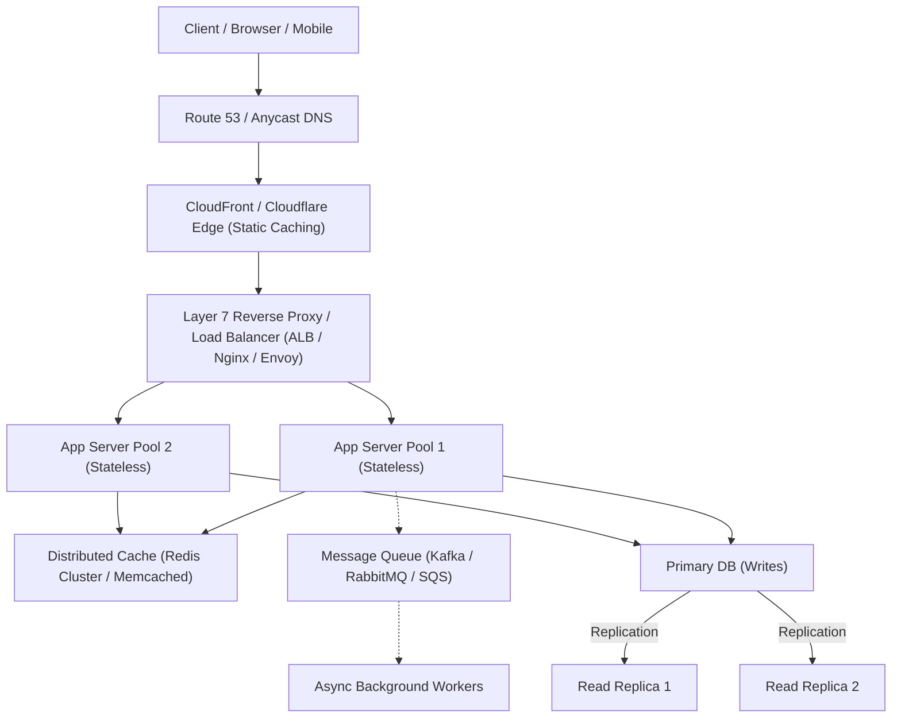

# System Design Primer & Reference 🏛️

A condensed reference for designing scalable, resilient, and fault-tolerant distributed architectures.

---

## 1. Back-of-the-Envelope Numbers Every Engineer Should Know

### Latency Comparison Numbers (Jeff Dean Baseline)

| Operation                               | Latency                 | Real-World Scale Equivalent |
| :-------------------------------------- | :---------------------- | :-------------------------- |
| **L1 cache reference**                  | 0.5 ns                  | 1 heart beat (0.5 s)        |
| **Branch mispredict**                   | 5 ns                    | 10 heart beats (5 s)        |
| **L2 cache reference**                  | 7 ns                    | 14 heart beats (7 s)        |
| **Mutex lock/unlock**                   | 25 ns                   | 50 heart beats (25 s)       |
| **Main memory reference (RAM)**         | 100 ns                  | 3.3 minutes                 |
| **Compress 1KB with Snappy**            | 2,000 ns (2 µs)         | 1 hour                      |
| **Send 1KB over 1 Gbps network**        | 10,000 ns (10 µs)       | 5.5 hours                   |
| **Read 1MB sequentially from SSD**      | 16,000 ns (16 µs)       | 9 hours                     |
| **Read 1MB sequentially from memory**   | 250,000 ns (250 µs)     | ~5.8 days                   |
| **Round trip in same datacenter**       | 500,000 ns (0.5 ms)     | ~11.6 days                  |
| **Read 1MB sequentially from disk**     | 20,000,000 ns (20 ms)   | ~1.5 years                  |
| **Packet round trip CA to Netherlands** | 150,000,000 ns (150 ms) | ~9.5 years                  |

### Capacity Estimation Rules of Thumb

- **1 Byte:** 8 bits (`char`, boolean)
- **1 KB:** $10^3$ bytes ($2^{10}$ = 1,024)
- **1 MB:** $10^6$ bytes (~1 million bytes)
- **1 GB:** $10^9$ bytes (~1 billion bytes)
- **1 TB:** $10^{12}$ bytes (~1 trillion bytes)
- **1 PB:** $10^{15}$ bytes (~1,000 TB)

**QPS Calculation Quick Formula:**

- 1 Million requests/day $\approx$ 12 requests/second.
- 10 Million requests/day $\approx$ 115 requests/second.
- 100 Million requests/day $\approx$ 1,160 requests/second.
- Peak QPS is typically assumed to be **$2\times$ to $5\times$** average QPS.

---

## 2. Core Scalability Dimensions

---

## 3. Distributed Architecture Patterns

### 1. CAP Theorem & Trade-Offs

- **Consistency (CP):** Every read receives the most recent write or an error (e.g., etcd, ZooKeeper, Google Spanner, HBase).
- **Availability (AP):** Every non-failing node returns a response, but it may not be the newest (e.g., Cassandra, DynamoDB with eventual consistency, CouchDB).

### 2. Caching Strategies

- **Cache-Aside (Lazy Loading):** App queries cache; on miss, queries DB and populates cache. Good for read-heavy workloads.
- **Write-Through:** App writes to cache; cache writes synchronously to DB. Zero stale data, but higher write latency.
- **Write-Behind (Write-Back):** App writes to cache; cache asynchronously writes to DB. Fast writes, risk of data loss on cache failure.
- **Refresh-Ahead:** Cache automatically reloads frequently accessed keys before expiration based on TTL.

### 3. Database Sharding & Partitioning

- **Vertical Partitioning:** Split by feature/domain (e.g., Users table on DB-A, Orders on DB-B).
- **Horizontal Sharding:** Split rows across multiple database instances using a shard key (e.g., `hash(user_id) % N`).
- **Consistent Hashing:** Minimizes key movement when adding or removing database nodes ($K/N$ keys remapped vs all keys).

---

## 4. Key References & Deep Dives

- [[Architecture/solution-architecture-concepts/system-design/README|Wiki System Design Hub]]
- [[Architecture/solution-architecture-concepts/reliability/availability|Availability, SLA & Error Budgets]]
- [[Architecture/solution-architecture-concepts/reliability/resilience|Resilience & Circuit Breakers]]
- [[Architecture/solution-architecture-concepts/performance/caching|Distributed Caching Architecture]]
- [The System Design Primer (Donne Martin)](https://github.com/donnemartin/system-design-primer)
