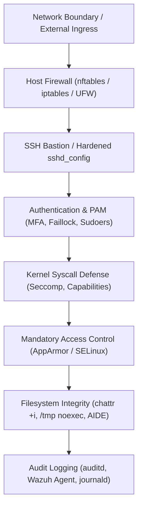

# Linux Host Hardening 🛡️

Systematic defense-in-depth baselines for securing Linux servers and Kubernetes container nodes against unauthorized access, privilege escalation, and lateral movement.

---

## 1. Hardening Architecture & Defense in Depth



---

## 2. Kernel & Network Hardening (`/etc/sysctl.d/99-security.conf`)

Apply hardened kernel parameters to protect against spoofing, packet routing attacks, and memory inspection:

```ini
# IP Spoofing protection & Reverse Path Filtering
net.ipv4.conf.all.rp_filter = 1
net.ipv4.conf.default.rp_filter = 1

# Ignore ICMP Broadcast & Bogus Error Responses
net.ipv4.icmp_echo_ignore_broadcasts = 1
net.ipv4.icmp_ignore_bogus_error_responses = 1

# Disable IP Source Routing (reject packet-specified routing)
net.ipv4.conf.all.accept_source_route = 0
net.ipv6.conf.all.accept_source_route = 0

# Disable ICMP Redirect Acceptance (prevent routing table tampering)
net.ipv4.conf.all.accept_redirects = 0
net.ipv4.conf.default.accept_redirects = 0
net.ipv4.conf.all.send_redirects = 0

# Enable TCP SYN Cookies (protect against SYN flood DoS)
net.ipv4.tcp_syncookies = 1

# Restrict dmesg kernel log access to root
kernel.dmesg_restrict = 1

# Restrict eBPF to CAP_BPF / root
kernel.unprivileged_bpf_disabled = 1

# Protect against pointer dereference vulnerabilities
kernel.kptr_restrict = 2

# Enable ASLR (Address Space Layout Randomization)
kernel.randomize_va_space = 2

# Restrict ptrace execution (prevent process memory snooping)
kernel.yama.ptrace_scope = 2
```

Reload settings:

```bash
sudo sysctl --system
```

---

## 3. SSH Server Hardening (`/etc/ssh/sshd_config.d/99-hardened.conf`)

Enforce modern cryptographic algorithms and disallow password-based authentication:

```ini
# Port and protocol
Port 22
Protocol 2

# Disable root login and passwords
PermitRootLogin no
PasswordAuthentication no
PermitEmptyPasswords no
AuthenticationMethods publickey

# Limit authentication attempts and session timeouts
MaxAuthTries 3
LoginGraceTime 30
ClientAliveInterval 300
ClientAliveCountMax 2

# Forwarding restrictions
X11Forwarding no
AllowTcpForwarding no
AllowAgentForwarding no

# Strict cryptographic ciphers and key exchange algorithms
KexAlgorithms curve25519-sha256@libssh.org,diffie-hellman-group-exchange-sha256
Ciphers chacha20-poly1305@openssh.com,aes256-gcm@openssh.com
MACs hmac-sha2-512-etm@openssh.com,hmac-sha2-256-etm@openssh.com
```

---

## 4. Mandatory Access Control (AppArmor & SELinux)

Restrict process execution boundaries regardless of root privileges:

- **AppArmor:** Path-based confinement (default on Ubuntu / Debian):
  ```bash
  # Check status of profiles
  sudo aa-status
  # Set profile to enforce mode
  sudo aa-enforce /etc/apparmor.d/usr.sbin.nginx
  ```
- **SELinux:** Label-based confinement (default on RHEL / Rocky / Fedora):
  ```bash
  # Check mode (Enforcing, Permissive, Disabled)
  getenforce
  # Restore default security contexts
  restorecon -Rv /var/www/
  ```

---

## 5. Related Deep Dives in Wiki

- [[Linux/security/README|Linux Security Subsystem]] — Linux capabilities, seccomp, auditd
- [[Linux/security/pam|PAM Authentication & Sudoers]] — Pluggable authentication modules
- [[Linux/security/apparmor|AppArmor Deep Dive]] — Profile syntax and Kubernetes annotations
- [[Security/endpoint-security/ids-ips/README|Host IDS/IPS]] — Wazuh and Suricata intrusion detection
