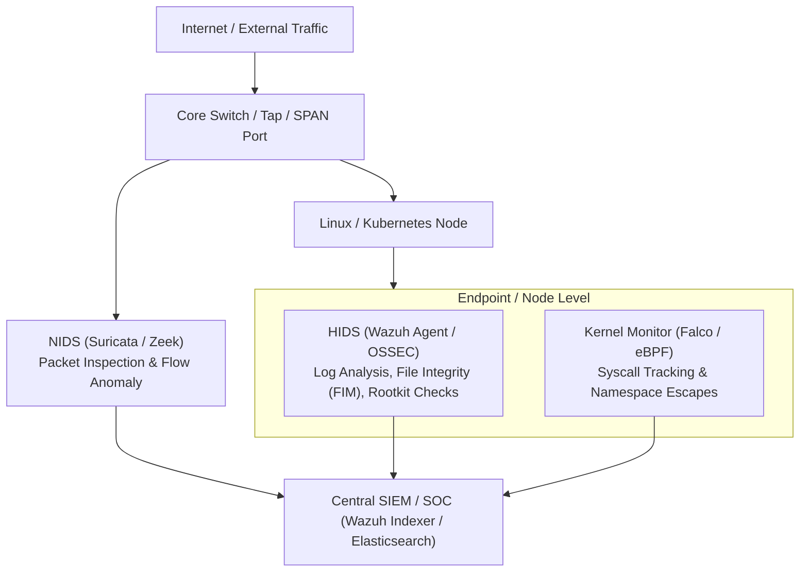

# Intrusion Detection & Prevention Systems (IDS/IPS) 🔍

Intrusion detection (IDS) monitors and alerts on suspicious traffic or host activity, while intrusion prevention (IPS) sits inline to actively drop malicious packets or kill offending processes.

---

## 1. NIDS vs HIDS Architecture



---

## 2. Host-Based IDS (HIDS): Wazuh & OSSEC

Wazuh operates as an endpoint agent analyzing host telemetry in real time:

- **Log Analysis:** Parses `/var/log/auth.log`, `journald`, syslog, and application logs using regex decoders.
- **File Integrity Monitoring (FIM):** Tracks real-time changes to critical binaries and configuration files (`/etc/passwd`, `/bin`, `/usr/sbin`) using inotify:
  ```xml
  <syscheck>
    <directories check_all="yes" realtime="yes">/etc,/usr/bin,/usr/sbin</directories>
    <ignore>/etc/mtab</ignore>
    <nodiff>/etc/shadow</nodiff>
  </syscheck>
  ```
- **Rootkit & Anomaly Detection:** Scans for hidden processes, kernel hooks, and promiscuous network interfaces.
- **Active Response (HIPS):** Executes automated mitigation scripts upon threat detection (e.g., firewalling an attacking IP via `iptables` or disabling a compromised user).

---

## 3. Network-Based IDS/IPS (NIDS): Suricata

Suricata is a multi-threaded high-performance NIDS/NIPS engine capable of multi-gigabit traffic inspection:

### Deployment Modes

1. **Passive TAP / SPAN (IDS Mode):** Receives mirrored copies of network packets. Zero impact on production latency; cannot drop packets directly.
2. **Inline Mode (IPS Mode):** Sits in the network path (using NFQueue or AF_PACKET inline mode) and actively drops packets matching drop rules.

### Rule Syntax Example

```suricata
# Detect and drop incoming SSH brute force attempts (5 failed attempts in 60s)
drop tcp any any -> $HOME_NET 22 (msg:"ET SCAN Potential SSH Brute Force"; \
    flow:to_server,established; content:"SSH-"; \
    threshold:type threshold, track by_src, count 5, seconds 60; \
    classtype:attempted-admin; sid:2001219; rev:1;)
```

---

## 4. Integration with SIEM & Automated Response

IDS alerts become actionable when routed through a security pipeline:

1. Suricata outputs `eve.json` (standardized EVE format).
2. Wazuh Agent reads `eve.json` and normalizes the events.
3. SIEM triggers automated Slack/PagerDuty incidents via [[Security/siem/wazuh/integrations/README|Wazuh & n8n integration]].

---

## Related Guides in Wiki

- [[Security/siem/wazuh/README|Wazuh SIEM Master Hub]]
- [[Security/endpoint-security/hardening/README|Linux Host Hardening]]
- [[Security/endpoint-security/falco/README|Falco Runtime Security & eBPF]]
- [[Security/endpoint-security/ids-ips/ids-types|Network & Host IDS Field Guide]]
