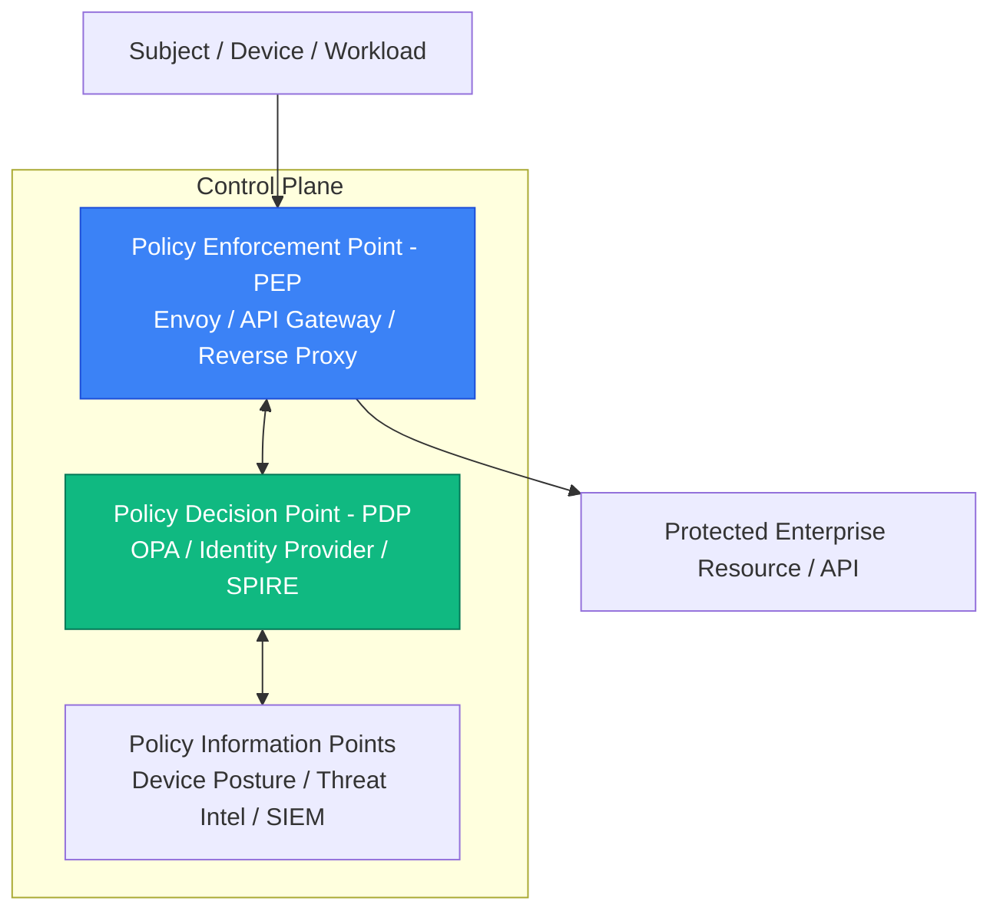

# Zero-Trust Architecture (NIST SP 800-207)

**Zero-Trust** is a cybersecurity paradigm focused on resource protection based on the premise that **trust is never granted implicitly based on network location**, physical proximity, or enterprise ownership.

Whether a client or microservice connects from a local office LAN, a corporate VPN, or the public internet, all requests must be continuously authenticated, authorized, and cryptographically verified.

---

## 1. The Three Core Tenets of Zero Trust

1. **Verify Explicitly:** Always authenticate and authorize based on all available data points (identity, location, device health, service or workload, data classification, and anomalies). Never assume trust from an internal IP address.
2. **Use Least-Privileged Access:** Limit user and service access with Just-In-Time (JIT) and Just-Enough-Access (JEA), risk-based adaptive policies, and data protection.
3. **Assume Breach:** Minimize blast radius by segmenting access by network, user, devices, and application awareness. Encrypt all sessions end-to-end. Use analytics to gain visibility and drive threat detection.

---

## 2. Zero-Trust Pillars Across the Stack

### 1. Identity & Access

- Eliminate passwords in favor of **FIDO2 / WebAuthn Passkeys**.
- Enforce risk-based **Conditional Access** (evaluating geographic anomalies and device compliance before issuing tokens).

### 2. Workload & Service-to-Service

- Eradicate static API keys and long-lived cloud credentials.
- Deploy **SPIFFE/SPIRE** for cryptographically attested workload identities.
- Enforce strict **mutual TLS (mTLS)** for all East-West microservice traffic.

### 3. Network & Microsegmentation

- Replace flat corporate VPNs with Zero-Trust Network Access (ZTNA) / BeyondCorp architectures.
- Enforce Kubernetes **NetworkPolicies** to restrict pod-to-pod communications on default-deny rules.

---

## 3. Related Deep Dives

- [[Architecture/solution-architecture-concepts/authentication/stage6/03-zero-trust-spiffe|Zero-Trust & Workload Identity]]: SPIFFE/SPIRE architecture, SVIDs, and secretless cloud federation.
- [[Kubernetes/concepts/L04-services-networking/05-network-policy|Kubernetes Network Policies]]: Enforcing L3/L4 zero-trust isolation inside Kubernetes clusters.

## Across the wiki

- [[Architecture/solution-architecture-concepts/security/security|Security Architecture]] — zero trust (Architecture)
- [[Architecture/solution-architecture-concepts/foundations/non-functional-requirements/security|Security]] — zero trust (Architecture)
- [[Architecture/solution-architecture-concepts/security/README|Security]] — zero trust (Architecture)
